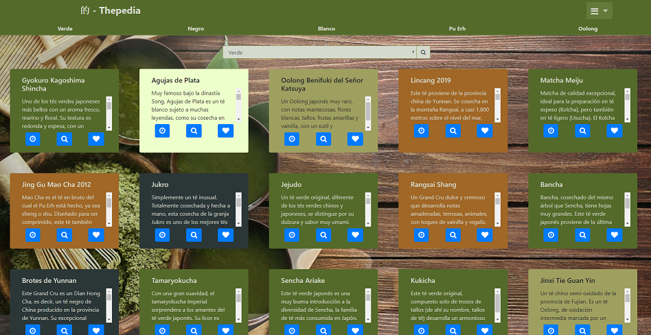

# :tea: Thepedia
## Versión Python
Pagina web diseñada para servir como biblioteca de tés online.

# :pencil: Descripción
-   En cualquiera de las paginas si se pulsa sobre el logo "***的 - Thepedia***" se redirigira hacia la pagina de inicio.
-   **En la pagina de inicio encontraremos**
    -   En la cabecera:
        -   El boton de redirección a inicio.
        -   5 botones que despliegan cada uno información general sonre cada tipo de té.
        -   Un boton desplegable. Si lo accionamos mostramos:
            -   Un boton de login/logout.
            -   Un boton para añador un té. (Solo funcional si nos hemos logeado)
            -   Un boton que despliega un pagina de conocimientos basicos sobre el té sus diferencia y su su origen.
    -   En el cuerpo:
        -   Un único boton que redirige a otra pagina donde se ven todos los tés disponibles en el datastore (*Ultimas Llegadas*).
-   **El la pagina de *Ultimas Llegadas***
    -   La misma cabecera que la pagina anterior.
    -   En el cuerpo:
        -   Un selector de busqueda donde podremos filtrar todos los tés según el tipo de té que deseemos. (Funcional unicamente si el usuario se ha logeado)
        -   Las fichas de todos los tés disponibles.
            -   Cada ficha esta compuesta por:
                -   El nombre de cada té.
                -   Una breve descrición.
                -   Tres botones: (Funcionales unicamente si el usuario se ha logeado)
                    -   *Chronos*: Muestra un desplegable donde se muestra una cuenta atras y una barra de progreso animada con el tiempo recomendado para la infusión del té.
                    -   *Ver*: Muestra un desplegable donde es visible información más detallada del té. Además permite imprimir un resumen de la información disponible.
                    -   *Gusta*: Permite significar a la web que este té nos gusta. Por lo que lo mostrara en una posición preferente en el momento de mostrar los tés de la pagina.
                -   El fondo de cada ficha cambiara según el té sea de un tipo u otro.
-   :rocket: **Funcionalidades generales:**
    -   *Añadir un té* (Funcional unicamente si el usuario se ha logeado)
        -   Parametros a introducir:
            -   Nombre
            -   Descripción
            -   Tipo de té (**Selector**)
            -   Región o País de Origen
            -   Tiempo de Infusión (**Selector**)
            -   Temperatura del agua (**Selector**)
            -   Gramos de té por cada 30cl de agua (**Selector**)
            -   *Los Selectores estan pre-rellenados con los valores más habituales, así se reduce en gran medida los valores erroneos que pueda introducir el usuario.*
            -   El atributo *Descripción esta limitado a un maximo de 500 carcteres*
    -   *Chronos* (Funcional unicamente si el usuario se ha logeado)
        -   Una vez iniciada la cuenta atras continuara hasta llegar a 0 : 0 en ese momento se habra alcanzado el tiempo **máximo recomendado** de infusión para el té.
    -   *Ver* (Funcional unicamente si el usuario se ha logeado)
        -   Muestra de forma simple toda la información disponible para el té seleccionado, ademas tambien muestra el número de "likes" que ha recibido.
        -   Permite imprimir el desplegable sin mostrar el fondo de la pagina web.
    -   *Gusta* (Funcional unicamente si el usuario se ha logeado)
        -   Envia al backend la orden de incrementar en 1 el contador de likes del té selecionado.
        -   Los tés que tengan un número mayor de "likes" seran mostrados de primeros.
    -   *Buscar un tipo de té* (Funcional unicamente si el usuario se ha logeado)
        -   Permite mostrar unicamente los tés que sea del tipo seleccionado.
        -   Para volver atras simplemente usar el boton "***的 - Thepedia***"

# :camera: Capturas de pantalla con ejemplos

## Pantalla de Inicio

## Pantalla de Inicio y el boton de opciones desplegado

## Pantalla correspondiente a la función *Añadir un té*

## Pantalla correspondiente a la página *Ultimas Llegadas*

## Pantalla correspondiente a la función de busqueda (*en este caso buscamos tés verdes*)

## Pantalla correspondiente a la función *Ver* de un té

